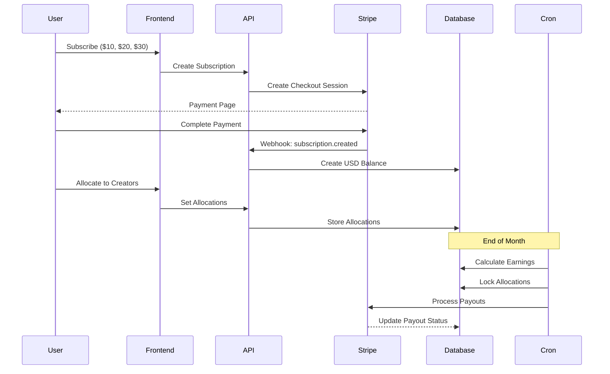
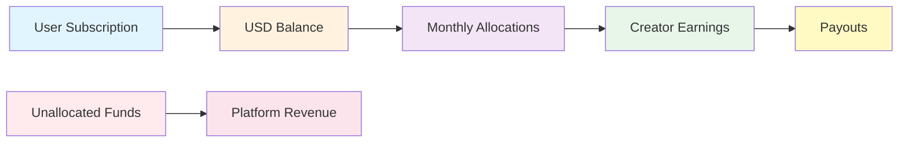
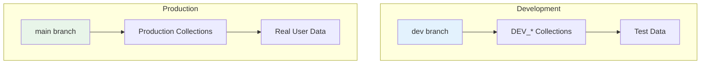

# WeWrite


**A social wiki where every page you write is a fundraiser.**

WeWrite transforms knowledge sharing into a collaborative economy where writers earn direct USD payments from their contributions and readers support creators with transparent monthly funding.

## Table of Contents

- [Connect With Us](#-connect-with-us)
- [What Makes WeWrite Special](#-what-makes-wewrite-special)
- [Quick Start](#-quick-start)
- [System Architecture](#-system-architecture)
- [Technology Stack](#-technology-stack)
- [Documentation](#-documentation)
- [Project Structure](#-project-structure)
- [Development](#-development)
- [Contributing](#-contributing)
- [License](#-license)
- [Support](#-support)

## 🌐 Connect With Us

- [🌍 Website](https://www.getwewrite.app/) - Try WeWrite now
- [📸 Instagram](https://www.instagram.com/getwewrite/) - Behind the scenes and updates
- [🎥 YouTube](https://www.youtube.com/@WeWriteApp/) - Tutorials and feature demos
- [𝕏 X](https://x.com/WeWriteApp) - Real-time updates and community
- [📺 Twitch](https://www.twitch.tv/wewriteapp) - Live streams and coding sessions
- [💬 Telegram](https://t.me/wewriteapp) - Join our community

## ✨ What Makes WeWrite Special

- **📝 Collaborative Writing** - Create and edit pages together with smart versioning
- **💰 Direct USD Payments** - Support creators with transparent monthly funding
- **🔗 Smart Linking** - Connect ideas across the platform with inline pill links
- **🌙 Beautiful Interface** - Clean, modern design with dark mode and glassmorphism
- **🔒 Secure & Private** - Your data is protected and encrypted
- **⚡ High Performance** - 90% cost reduction through optimization strategies

## 🚀 Quick Start

### Prerequisites

- **Node.js** 20.x or higher
- **Bun** (preferred package manager - faster than npm/pnpm)

### Installation

```bash
# Install Bun if you don't have it
curl -fsSL https://bun.sh/install | bash

# Clone the repository
git clone https://github.com/WeWriteApp/WeWrite.git
cd WeWrite

# Install dependencies
bun install

# Set up environment variables
cp .env.example .env.local
# Edit .env.local with your configuration

# Run the development server
bun dev
```

Open [http://localhost:3000](http://localhost:3000) to see WeWrite in action!

## 🏗️ System Architecture

### High-Level Architecture

```mermaid
graph TB
    subgraph "Client Layer"
        Web[Next.js Web App]
        PWA[Progressive Web App]
    end

    subgraph "API Layer"
        API[API Routes]
        Webhooks[Stripe Webhooks]
        Cron[Cron Jobs]
    end

    subgraph "Service Layer"
        Auth[Authentication Service]
        Payment[Payment Service]
        Earnings[Earnings Service]
        Email[Email Service]
        Search[Search Service]
    end

    subgraph "Data Layer"
        Firebase[(Firebase)]
        Firestore[(Firestore DB)]
        Storage[(Firebase Storage)]
    end

    subgraph "External Services"
        Stripe[Stripe Payments]
        Resend[Resend Email]
    end

    Web --> API
    PWA --> API
    API --> Service Layer
    Webhooks --> Service Layer
    Cron --> Service Layer
    Service Layer --> Data Layer
    Payment --> Stripe
    Email --> Resend
    Auth --> Firebase
```

### Payment Flow Architecture



### Data Flow



### Environment Architecture



## 🛠️ Technology Stack

### Core Technologies

- **⚛️ [Next.js 14](https://nextjs.org/)** - React framework with App Router
- **🔥 [Firebase](https://firebase.google.com/)** - Backend-as-a-Service platform
- **🎨 [Tailwind CSS](https://tailwindcss.com/)** - Utility-first CSS framework
- **📝 [Slate.js](https://slatejs.org/)** - Customizable rich text editor framework
- **💳 [Stripe](https://stripe.com/)** - Payment processing and subscriptions
- **🔍 [TypeScript](https://www.typescriptlang.org/)** - Type-safe JavaScript development

### Firebase Services

- **🗄️ Firestore** - NoSQL document database for pages, users, and versions
- **🔐 Authentication** - Email/password authentication with session management
- **☁️ Functions** - Serverless functions for webhooks and background processing
- **📁 Storage** - File storage for images and attachments

### Development & Deployment

- **📦 [Bun](https://bun.sh/)** - Fast, disk space efficient package manager
- **🚀 [Vercel](https://vercel.com/)** - Deployment platform with automatic CI/CD
- **📊 [LogRocket](https://logrocket.com/)** - Session replay and error tracking

### Key Features

- **🌙 Dark Mode** - System-aware theme switching with OKLCH color system
- **📱 Responsive Design** - Mobile-first responsive interface
- **🔗 Smart Linking** - Automatic page linking and backlinks with inline pills
- **💰 USD Creator Support** - Direct USD payments with transparent monthly funding
- **🔒 Security** - Comprehensive security measures and data protection
- **⚡ Performance** - 90% cost reduction through aggressive optimization

## 📚 Documentation

### Essential Documentation (Start Here)

- **[Current Architecture](docs/architecture/CURRENT_ARCHITECTURE.md)** - Complete system overview and architecture principles
- **[Environment Quick Reference](docs/deployment/ENVIRONMENT_QUICK_REFERENCE.md)** - Development environment setup
- **[Performance Optimization Guide](docs/performance/PERFORMANCE_OPTIMIZATION_GUIDE.md)** - Optimization strategies (90% cost reduction achieved)

### Core Systems

#### Authentication & Security
- [Authentication Architecture](docs/architecture/AUTHENTICATION_ARCHITECTURE.md) - Environment-specific authentication rules
- [Username Security Guidelines](docs/security/USERNAME_SECURITY_GUIDELINES.md) - Prevent email exposure vulnerabilities
- [User Data Fetching Patterns](docs/architecture/USER_DATA_FETCHING_PATTERNS.md) - Standardized patterns for secure user data handling
- [Security Audit Report](docs/security/SECURITY_AUDIT_REPORT.md) - Security posture and best practices

#### Payment & Financial System
- [Payments and Allocations](docs/payments/PAYMENTS_AND_ALLOCATIONS.md) - Main payments documentation
- [Allocation System](docs/payments/ALLOCATION_SYSTEM.md) - USD allocation architecture
- [Subscription System](docs/payments/SUBSCRIPTION_SYSTEM.md) - Subscription management and Stripe integration
- [Payout Troubleshooting Guide](docs/payments/PAYOUT_TROUBLESHOOTING_GUIDE.md) - Common payout issues and solutions
- [Financial Data Architecture](docs/payments/FINANCIAL_DATA_ARCHITECTURE.md) - Separated financial contexts architecture

#### Content & Editor
- [Page Data and Versions](docs/architecture/PAGE_DATA_AND_VERSIONS.md) - Authoritative page data structure and version system
- [Text Selection and Attribution](docs/editor/TEXT_SELECTION_AND_ATTRIBUTION.md) - Selection & attribution system
- [Writing Suggestions System](docs/editor/WRITING_SUGGESTIONS_SYSTEM.md) - Writing suggestion features
- [Line Based Editor](docs/editor/LINE_BASED_EDITOR.md) - Editor implementation details

#### Search & Discovery
- [Search Architecture](docs/SEARCH_ARCHITECTURE.md) - Search system architecture
- [Search Performance Optimizations](docs/search/SEARCH_PERFORMANCE_OPTIMIZATIONS.md) - Performance tuning

### UI & Design

- [Design System Architecture](docs/ui/DESIGN_SYSTEM_ARCHITECTURE.md) - FloatingCard component system and glassmorphism guidelines
- [Theme System Architecture](docs/ui/THEME_SYSTEM_ARCHITECTURE.md) - Theme and styling system
- [Complete Color System](docs/ui/COMPLETE_COLOR_SYSTEM.md) - OKLCH color space for better accessibility
- [Header System](docs/ui/HEADER_SYSTEM.md) - Navigation header architecture

### Performance & Optimization

- [Performance Optimization Guide](docs/performance/PERFORMANCE_OPTIMIZATION_GUIDE.md) - Performance strategies
- [Firebase Optimization Guide](docs/firebase/FIREBASE_OPTIMIZATION_GUIDE.md) - Firebase cost and performance optimization
- [Navigation Caching Optimization](docs/performance/NAVIGATION_CACHING_OPTIMIZATION.md) - Navigation performance optimization
- [Logging Noise Reduction](docs/performance/LOGGING_NOISE_REDUCTION.md) - Log management strategies

### Deployment & Operations

- [Production Deployment Guide](docs/deployment/PRODUCTION_DEPLOYMENT_GUIDE.md) - Deployment procedures and best practices
- [Branch Aware Development](docs/deployment/BRANCH_AWARE_DEVELOPMENT.md) - Development workflow and environment switching
- [Webhook Setup Guide](docs/deployment/WEBHOOK_SETUP_GUIDE.md) - Stripe webhook configuration

### Development Standards

- [Dependency Management Standards](docs/maintenance/DEPENDENCY_MANAGEMENT_STANDARDS.md) - Package management standards
- [Legacy Code Cleanup Guide](docs/maintenance/LEGACY_CODE_CLEANUP_GUIDE.md) - Identifying and removing deprecated patterns

### Full Documentation Index

For a complete list of all documentation, see [docs/README.md](docs/README.md).

## 📁 Project Structure

```
WeWrite/
├── app/                      # Next.js App Router
│   ├── api/                 # API routes and endpoints
│   │   ├── admin/          # Admin API endpoints
│   │   ├── cron/           # Scheduled job endpoints
│   │   └── webhooks/       # Stripe webhook handlers
│   ├── admin/              # Admin dashboard pages
│   ├── auth/               # Authentication pages
│   ├── components/         # Reusable UI components
│   │   ├── admin/         # Admin-specific components
│   │   ├── editor/        # Rich text editor components
│   │   ├── landing/       # Landing page components
│   │   ├── layout/        # Layout components
│   │   ├── payments/      # Payment UI components
│   │   └── ui/            # Shared UI components
│   ├── contexts/           # React contexts for global state
│   ├── hooks/              # Custom React hooks
│   ├── lib/                # Utility libraries and helpers
│   ├── providers/          # Context providers
│   ├── services/           # Business logic services
│   ├── settings/           # User settings pages
│   └── utils/              # Utility functions
├── docs/                   # Technical documentation
│   ├── architecture/       # System architecture docs
│   ├── auth/              # Authentication docs
│   ├── deployment/        # Deployment guides
│   ├── editor/            # Editor documentation
│   ├── features/          # Feature-specific docs
│   ├── firebase/          # Firebase patterns
│   ├── payments/          # Payment system docs
│   ├── performance/       # Performance guides
│   ├── search/            # Search system docs
│   ├── security/          # Security documentation
│   └── ui/                # UI and design docs
├── functions/              # Firebase Cloud Functions
├── public/                 # Static assets
│   ├── icons/             # App icons and favicons
│   └── images/            # Images and graphics
└── scripts/                # Build and utility scripts
```

### Key Directories

- **`app/`** - Next.js 14 App Router with file-based routing
- **`app/components/`** - Reusable UI components organized by feature
- **`app/services/`** - Business logic services (payment, earnings, email, etc.)
- **`app/api/`** - API routes for backend functionality
- **`docs/`** - Comprehensive technical documentation
- **`functions/`** - Firebase Cloud Functions for webhooks and background tasks

## 🔧 Development

### Development Commands

```bash
# Start development server
bun dev

# Start with HTTPS (for PWA testing)
bun dev:https

# Build for production
bun build

# Run tests
bun test

# Run tests in watch mode
bun test:watch

# Run specific test suites
bun test:payments
bun test:payouts
bun test:allocation
```

### Branch-Aware Environment

WeWrite uses **branch-aware environment detection** for local development:

- **Main branch** (`main`): Uses **production collections** - connects to real data
- **Dev branch** (`dev`): Uses **dev collections** (`DEV_*` prefix) - isolated test data
- **Other branches**: Uses **dev collections** (safe default) - isolated test data

This ensures you can test against production data when needed (main branch) while keeping development work safely isolated (dev branch).

### Code Quality

Before contributing, ensure you follow:

1. **TypeScript strict mode** - All code must be type-safe
2. **ESLint rules** - Run `bun lint` before committing
3. **Security guidelines** - Follow [USERNAME_SECURITY_GUIDELINES](docs/security/USERNAME_SECURITY_GUIDELINES.md)
4. **Performance practices** - Follow [PERFORMANCE_OPTIMIZATION_GUIDE](docs/performance/PERFORMANCE_OPTIMIZATION_GUIDE.md)

## 🚀 Deployment

### Automatic Deployment

WeWrite uses Vercel for automatic deployment:

- **Production**: Deploys from `main` branch to [wewrite.app](https://wewrite.app)
- **Preview**: Deploys from `dev` branch for testing
- **Environment Variables**: Configured in Vercel dashboard

See [Production Deployment Guide](docs/deployment/PRODUCTION_DEPLOYMENT_GUIDE.md) for detailed procedures.

## 🤝 Contributing

We welcome contributions! Here's how to get started:

1. **Fork the repository**
2. **Create a feature branch** (`git checkout -b feature/amazing-feature`)
3. **Follow our coding standards** (see documentation)
4. **Write tests** for new functionality
5. **Commit your changes** with clear messages
6. **Submit a pull request**

### Development Guidelines

- **Security First**: Follow [USERNAME_SECURITY_GUIDELINES](docs/security/USERNAME_SECURITY_GUIDELINES.md)
- **Clean Code**: Use [LEGACY_CODE_CLEANUP_GUIDE](docs/maintenance/LEGACY_CODE_CLEANUP_GUIDE.md)
- **Testing**: Write comprehensive tests for all features
- **Documentation**: Update docs for any new features or changes

### Code of Conduct

- Be respectful and inclusive
- Focus on constructive feedback
- Help create a welcoming environment for all contributors

## 📄 License

This project is licensed under the GNU General Public License v3.0 - see the [LICENSE.md](LICENSE.md) file for details.

This is free software: you are free to change and redistribute it under the terms of the GPL-3.0 license.

## 💬 Support

- **📧 Email**: [support@wewrite.app](mailto:support@wewrite.app)
- **💬 Discord**: [Join our community](https://discord.gg/wewrite)
- **🐛 Issues**: [GitHub Issues](https://github.com/WeWriteApp/WeWrite/issues)
- **📖 Documentation**: [docs/](docs/) directory

## 🙏 Acknowledgments

Built with modern web technologies and powered by:

- [Next.js](https://nextjs.org/) - The React Framework
- [Firebase](https://firebase.google.com/) - Backend-as-a-Service
- [Stripe](https://stripe.com/) - Payment Infrastructure
- [Tailwind CSS](https://tailwindcss.com/) - Utility-First CSS
- [Vercel](https://vercel.com/) - Deployment Platform

---

**Made with ❤️ by the WeWrite team**

[⬆ Back to top](#wewrite)
