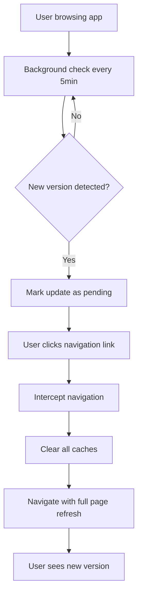

# Automatic App Updates System

WeWrite uses a seamless automatic update system that keeps users on the latest version without any disruptive modals or manual refresh buttons.

## How It Works

### Background Detection
- The system continuously checks for new app versions every 5 minutes
- Uses build timestamp comparison to detect new deployments
- Runs completely in the background with minimal performance impact

### Seamless Updates
- When a new version is detected, the system prepares for an automatic update
- On the user's **next navigation event**, it seamlessly refreshes the app
- The user experiences what feels like a normal page navigation, but gets the new version
- No modals, popups, or manual refresh buttons required

### User Experience
```
User clicks a link → System detects pending update → Clears caches → Navigates to new page with latest version
```

The user never knows an update happened - it just feels like normal navigation!

## Technical Implementation

### Core Components

#### AutomaticUpdateManager
- **Location**: `app/components/common/AutomaticUpdateManager.tsx`
- **Purpose**: Handles all automatic update logic
- **Placement**: Added to root layout, runs globally

#### Key Features
1. **Background Checking**: Polls `/api/build-info` every 5 minutes
2. **Router Interception**: Temporarily overrides `router.push()` when update is pending
3. **Cache Clearing**: Removes all browser and service worker caches before update
4. **Navigation Preservation**: Ensures user reaches their intended destination

### Update Flow



### API Endpoints

#### `/api/build-info`
Returns the current build timestamp:
```json
{
  "buildTime": "2025-01-15T10:30:45.123Z"
}
```

#### `/api/version` (legacy)
Still exists for compatibility but automatic updates only use `buildTime`

## Configuration

### Environment Behavior
- **Development (`localhost`)**: Completely disabled to avoid interference
- **Production**: Fully active with 5-minute check intervals

### Customization Options
The system is designed to work automatically, but key parameters can be adjusted:

```typescript
// In AutomaticUpdateManager.tsx
const CHECK_INTERVAL = 5 * 60 * 1000; // 5 minutes
const INITIAL_DELAY = 3000; // 3 seconds after app load
```

## Safety Features

### Error Handling
- Network failures gracefully degrade to normal navigation
- Cache clearing errors don't prevent updates
- Fallback to standard router.push() if update fails

### Performance Safeguards
- Debounced API calls prevent excessive requests
- Minimal payload (only build timestamp, not full app data)
- Efficient caching prevents redundant checks

### User Protection
- Never interrupts active user interactions
- Only triggers on user-initiated navigation
- Preserves user's intended destination

## Migration from Manual Updates

### Removed Components
- ❌ `AppUpdateModal.tsx` - Manual refresh modal
- ❌ `UpdateAvailableModal.tsx` - Update notification modal
- ❌ `useAppUpdate.ts` - Manual update hook
- ❌ Manual refresh buttons and user prompts

### Replaced With
- ✅ `AutomaticUpdateManager.tsx` - Seamless background updates
- ✅ Zero user interaction required
- ✅ Updates happen during natural navigation flow

## Benefits

### For Users
- **Seamless Experience**: No interruptions or manual actions required
- **Always Current**: Automatically stay on the latest version
- **Natural Flow**: Updates feel like normal navigation
- **No Decisions**: No "Update now?" or "Remind me later" choices

### For Developers
- **Simplified Deployment**: No need to manage update notifications
- **Better Adoption**: 100% of users get updates automatically
- **Reduced Support**: No "please refresh your browser" requests
- **Clean Architecture**: Single responsibility, well-documented system

## Monitoring and Debugging

### Console Logs
The system provides detailed logging for debugging:

```javascript
// Update detection
🔄 [AutoUpdate] New version detected: { current: "...", new: "..." }

// Update application
🚀 [AutoUpdate] Applying update during navigation to: /target-route

// Error handling
⚠️ [AutoUpdate] Failed to check for updates: Error details
```

### Development Testing
To test the automatic update system:

1. **Build and deploy** a new version
2. **Wait 5 minutes** for background check (or trigger manually)
3. **Click any navigation link** - update should apply seamlessly
4. **Check console** for update logs
5. **Verify new version** is active

### Troubleshooting

#### Updates Not Applying
- Check console for error messages
- Verify `/api/build-info` returns new timestamp
- Ensure not running on localhost (updates disabled in dev)

#### Navigation Issues
- System preserves all navigation behavior
- Fallback to normal navigation if update fails
- Check for JavaScript errors in console

## Future Enhancements

### Potential Improvements
- **Smart Timing**: Delay updates during active editing sessions
- **Bandwidth Detection**: Skip cache clearing on slow connections
- **Update Notifications**: Optional subtle indicators for power users
- **Rollback Support**: Ability to revert to previous version if issues detected

### Analytics Integration
Consider tracking update success rates and user experience metrics:
- Update detection frequency
- Navigation interception success
- Cache clearing performance
- User session continuity

---

This automatic update system ensures WeWrite users always have the latest features and fixes without any manual intervention, creating a seamless and modern web application experience.
