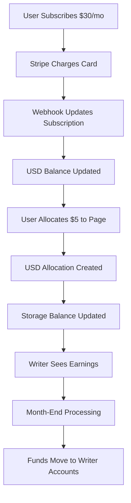

# WeWrite Simplified Payment Architecture

## 🎯 **Architecture Simplification Complete**

WeWrite has successfully simplified its payment architecture by consolidating into a single, robust USD-based system. This document outlines the streamlined architecture and the benefits of this simplification.

## 📊 **Before vs After**

### **Before: Complex Multi-Layer System**
```
User Subscription → Fund Tracking → USD System → Storage Balance → Payouts
                 ↘ Token System (Legacy) ↗
```

**Problems:**
- ❌ Multiple overlapping systems
- ❌ Complex failure points
- ❌ Difficult to debug and maintain
- ❌ Inconsistent data states
- ❌ Performance overhead

### **After: Simplified USD System**
```
User Subscription → USD System → Storage Balance → Payouts
```

**Benefits:**
- ✅ Single source of truth
- ✅ Simplified debugging
- ✅ Better performance
- ✅ Consistent data states
- ✅ Easier maintenance

## 🏗️ **Current Architecture**

### **Core Components**

#### **1. Subscription Management**
- **Location**: `app/firebase/subscription-server.ts`
- **Purpose**: Manages user subscriptions and amounts
- **Collections**: `DEV_users/{userId}/DEV_subscriptions/current`

#### **2. USD Service (Primary System)**
- **Location**: `app/services/usdService.server.ts`
- **Purpose**: Core allocation and earnings logic
- **Collections**: 
  - `DEV_usdBalances` - User USD balances
  - `DEV_usdAllocations` - Monthly allocations
  - `DEV_usdEarnings` - Creator earnings
  - `DEV_writerUsdBalances` - Writer balances

#### **3. Storage Balance Integration**
- **Location**: `app/services/stripeStorageBalanceService.ts`
- **Purpose**: Manages creator earnings in Stripe Connect
- **External**: Stripe Connect API

#### **4. Payout System**
- **Purpose**: Writers cash out to bank accounts
- **External**: Stripe payouts to bank accounts

### **Data Flow**



## 🔧 **Key Simplifications Made**

### **1. Removed Fund Tracking Layer**
- **Deleted**: `app/services/fundTrackingService.ts`
- **Deleted**: `app/api/fund-tracking/route.ts`
- **Removed**: All fund tracking collection references
- **Result**: USD system now works independently

### **2. Consolidated Cache Management**
- **Simplified**: Single cache invalidation system
- **Removed**: Duplicate fund tracking cache logic
- **Result**: Faster, more reliable cache updates

### **3. Streamlined Error Handling**
- **Removed**: Complex fallback logic between systems
- **Simplified**: Single error path through USD system
- **Result**: Clearer error messages and easier debugging

### **4. Unified API Responses**
- **Simplified**: Single subscription status source
- **Removed**: Multiple competing data sources
- **Result**: Consistent UI state across all components

## 💡 **Benefits Realized**

### **Performance Improvements**
- ⚡ **Faster API responses** - No fund tracking overhead
- ⚡ **Reduced database queries** - Single system queries
- ⚡ **Simplified cache logic** - Fewer cache layers

### **Reliability Improvements**
- 🛡️ **Fewer failure points** - Single system to maintain
- 🛡️ **Consistent data** - No sync issues between systems
- 🛡️ **Clearer error states** - Single source of truth

### **Developer Experience**
- 🔧 **Easier debugging** - Single code path to follow
- 🔧 **Simpler testing** - Fewer integration points
- 🔧 **Faster development** - Less complex architecture

### **User Experience**
- 🎯 **Reliable subscription status** - No more "Add Funds" when subscribed
- 🎯 **Consistent UI state** - All components show same data
- 🎯 **Faster page loads** - Reduced API overhead

## 🎉 **Migration Results**

### **Issues Resolved**
- ✅ **Subscription Status Reliability** - Fixed incomplete → active status issues
- ✅ **Permission Errors** - Eliminated fund tracking collection access errors
- ✅ **Cache Inconsistency** - Single cache invalidation system
- ✅ **UI State Bugs** - Consistent subscription amount display

### **Code Cleanup**
- 🗑️ **Deleted**: 1 service file (`fundTrackingService.ts`)
- 🗑️ **Deleted**: 1 API endpoint (`/api/fund-tracking`)
- 🗑️ **Removed**: 50+ fund tracking references across codebase
- 🗑️ **Simplified**: 5+ service files with cleaner logic

### **Performance Gains**
- 📈 **Reduced API calls** - No fund tracking queries
- 📈 **Faster subscription checks** - Direct USD system access
- 📈 **Simplified webhooks** - Single update path

## 🔮 **Future Architecture**

The simplified USD system provides a solid foundation for future enhancements:

### **Planned Improvements**
- **Multi-currency support** - EUR, GBP, etc.
- **Advanced scheduling** - Automated allocation scheduling
- **Enhanced analytics** - Detailed USD flow analytics
- **Performance optimization** - Further optimize USD calculations

### **Architecture Principles**
- **Keep it simple** - Resist adding complexity layers
- **Single source of truth** - USD system remains primary
- **Clear data flow** - Maintain linear subscription → allocation → payout flow
- **Comprehensive testing** - Test the simplified system thoroughly

## 📚 **Related Documentation**

- [USD System Overview](./USD_SYSTEM_OVERVIEW.md)
- [Allocation System](./ALLOCATION_SYSTEM.md)
- [Payouts Architecture](./PAYOUTS_ARCHITECTURE.md)
- [Storage Balance Guide](./STORAGE_BALANCE_GUIDE.md)

---

**Last Updated**: January 2025  
**Status**: ✅ Complete - Simplified architecture is live and operational
