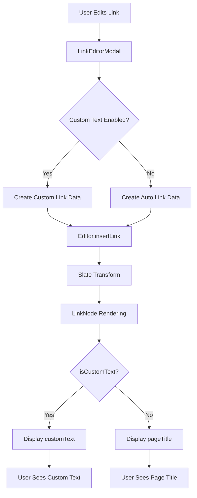

# WeWrite Link System

## Requirements

### Display Behavior Requirements
- **Internal Links**: Must display as pill links (inline visual elements) in both editor and view modes
- **Auto Links**: Must automatically display the current page title and update when the page title changes
- **Custom Text Links**: Must display user-defined custom text and never auto-update
- **External Links**: Must display either the URL (auto mode) or custom text (custom mode)
- **Immediate Updates**: Changes to link text must appear immediately in both editor and view modes
- **Line Numbers**: Editor must display line numbers to help users understand line manipulation in dense mode

### User Interaction Requirements
- **Toggle Switch**: Users must be able to enable/disable custom text with a simple toggle switch
- **Input Field Behavior**: When custom text is enabled, input field must appear with current custom text pre-populated
- **Live Preview**: Link editing interface must provide immediate visual feedback when editing links
- **Persistence**: Custom text settings and values must persist after page reload and across editing sessions
- **Fallback Logic**: When custom text is enabled but empty, must fall back to page title display
- **Backward Compatibility**: Must handle existing links created with previous versions of the system

### Technical Requirements
- **Data Structure**: Links must use consistent `isCustomText`, `customText`, and `children` properties
- **Migration Handling**: Legacy links without `isCustomText` property must be automatically migrated
- **Single Implementation**: Must use one canonical editor implementation without fallbacks
- **Embedded Objects**: Inline pill links must be implemented as embedded objects in the editor
- **Toggle Behavior**: Internal links must allow toggling custom text on/off with automatic reversion to page title when disabled

## Overview

The WeWrite link system supports both internal page links and external links, providing automatic title updates while respecting user customization. This document describes the clean, maintainable architecture that replaced the previous complex system.

## Core Principles

1. **Simple Data Structure**: Clear separation between auto-generated and custom text
2. **Automatic Updates**: Page title changes automatically update internal links
3. **User Control**: Users can set custom text that won't be auto-updated
4. **External Link Support**: Full support for external URLs with custom display text
5. **No Maintenance Nightmares**: Clean, obvious code with descriptive naming
6. **Intuitive Editing**: When editing links, the current display text is pre-filled for easy customization

## Link Node Structure

```typescript
interface LinkNode {
  type: 'link';

  // Target information
  pageId?: string; // Required for internal links, optional for external
  pageTitle?: string; // Current title of target page (auto-updated for internal links)
  url: string; // URL path to page or external URL

  // Display text logic
  isCustomText: boolean; // Whether user has set custom display text
  customText?: string; // User-provided custom text (only if isCustomText = true)

  // Link type metadata
  isExternal?: boolean; // True for external links
  isPublic?: boolean;
  isOwned?: boolean;

  // Slate.js structure
  children: Array<{ text: string }>; // The actual rendered text
}
```

## Display Logic

### Internal Page Links
- **If `isCustomText = false`**: Show `pageTitle` (auto-updated when page title changes)
- **If `isCustomText = true`**: Show `customText` (never auto-updated)

### External Links
- **If `isCustomText = false`**: Show `url` (the actual URL)
- **If `isCustomText = true`**: Show `customText` (user-defined display text)

## Custom Text Functionality

### How Custom Text Works

The custom text system allows users to override the automatic page title display with their own text:

1. **Toggle Control**: Users can enable/disable custom text with a simple toggle switch
2. **Text Input**: When enabled, users can enter any custom text they want
3. **Persistence**: Custom text is saved and persists across page reloads and edits
4. **Reversion**: When disabled, the link automatically reverts to showing the page title

### Custom Text Data Flow

```typescript
// 1. LinkEditorModal creates link data
const linkData = {
  hasCustomText: true,        // User enabled custom text
  isCustomText: true,         // For LinkNode compatibility
  text: "My Custom Text",     // The custom text entered
  customText: "My Custom Text" // Stored custom text value
};

// 2. Editor processes the data
const hasCustomText = linkData.hasCustomText && linkData.text;
if (hasCustomText) {
  // Create link with custom text
  linkElement = {
    type: 'link',
    isCustomText: true,
    customText: "My Custom Text",
    children: [{ text: "My Custom Text" }] // This is what displays
  };
}

// 3. PillLink displays the text
const displayText = linkElement.children[0].text; // "My Custom Text"
```

### Custom Text States

- **Disabled (Default)**: `isCustomText: false` → Shows page title, auto-updates when page title changes
- **Enabled with Text**: `isCustomText: true` → Shows custom text, never auto-updates
- **Enabled but Empty**: Treated as disabled → Reverts to page title

## Editing Experience

When a user edits an existing link:

1. **Current Display Text**: The modal pre-fills with whatever text is currently being displayed
2. **Search Pre-filling**: For internal links, the search field is pre-populated with the current page title for easy replacement
3. **Custom Text Toggle**:
   - **Turning ON**: Uses current display text as starting point for customization
   - **Turning OFF**: Reverts to auto-generated page title (clears custom text)
4. **Live Updates**: Changes are immediately applied to the existing link in the editor
5. **Seamless Transition**: Users can easily switch between auto-generated and custom text modes

This ensures that users always see what they expect and can easily customize link text without losing context.

## Compound Links (Show Author)

Compound links display both the page title and author information:

1. **Page Link**: Standard page pill with custom or auto-generated text
2. **Author Attribution**: Uses UsernameBadge component with subscription status
3. **Efficient Data**: Leverages existing user data caching to avoid duplicate API calls
4. **Consistent Styling**: Follows the same design patterns as other UsernameBadge instances

## Technical Implementation Details

### Unified Link Processing Flow

1. **Data Extraction**: SlateEditor extracts current display text, link properties, and element path
2. **Modal Pre-filling**: LinkEditorModal receives both custom text and current display text
3. **Smart Defaults**: When custom text toggle is enabled, it uses the current display text as default
4. **Unified Processing**:
   - **Single `createLinkElement()` Function**: Creates consistent link elements for all scenarios
   - **Single `insertLink()` Handler**: Uses `Transforms.setNodes()` for both new and existing links
   - **Path-Based Updates**: Existing links updated at their stored path, new links inserted at selection
5. **Bidirectional Toggle**: Custom text can be enabled (with current text) or disabled (revert to page title)

### Key Technical Features

- **currentDisplayText**: Always passed to editing modal to show what user currently sees
- **isCustomText Detection**: Uses both explicit flag and text comparison for robust detection
- **Fallback Chain**: Multiple fallbacks ensure display text is never empty
- **Helper Functions**: Centralized logic in LinkNodeHelper and modal helpers for consistency
- **Efficient Caching**: UsernameBadge components use existing user data cache to prevent duplicate API calls
- **Search Pre-filling**: Editing modal pre-populates search with current page for easy replacement
- **No Autocomplete**: Input fields use `autoComplete="off"` to prevent browser suggestions for non-repeatable content
- **Unified Processing**: Single code path handles both new link creation and existing link updates

## Title Update System

When a page title changes:

1. **Auto-generated links** (`isCustomText = false`):
   - `pageTitle` is updated to new title
   - `children[0].text` is updated to new title
   - Link displays new title automatically

2. **Custom text links** (`isCustomText = true`):
   - `pageTitle` is updated for reference
   - `customText` and `children[0].text` remain unchanged
   - Link continues to display user's custom text

## Helper Functions

### LinkNodeHelper

```typescript
// Internal page links
LinkNodeHelper.createAutoLink(pageId, pageTitle, url)
LinkNodeHelper.createCustomLink(pageId, pageTitle, url, customText)

// External links
LinkNodeHelper.createAutoExternalLink(url) // Shows URL as display text
LinkNodeHelper.createCustomExternalLink(url, customText) // Shows custom text

// Update page title (respects custom text)
LinkNodeHelper.updatePageTitle(link, newPageTitle)

// Convert to custom text
LinkNodeHelper.setCustomText(link, customText)

// Convert back to auto-generated
LinkNodeHelper.removeCustomText(link)
```

### Migration

The system automatically migrates old link formats:

```typescript
// Old messy format with text, displayText, originalPageTitle, etc.
// Gets converted to clean LinkNode structure for both internal and external links
LinkMigrationHelper.migrateOldLink(oldLink)
```

#### External Link Migration

For external links that may be missing proper custom text fields:

```bash
# Run the external link migration script
node scripts/fix-external-link-custom-text.js
```

This script:
- Identifies external links where display text differs from URL
- Adds proper `isCustomText` and `customText` fields
- Removes incorrect custom text flags from URL-only links

## Implementation Files

- **`/app/types/linkNode.ts`**: Clean data structure and helper functions
- **`/app/api/pages/route.ts`**: Title update system with migration
- **`/app/components/editor/SlateEditor.tsx`**: Link creation and editing logic
- **`/app/components/editor/LinkEditorModal.tsx`**: UI for creating/editing links with smart pre-filling
- **`/app/components/editor/LinkNode.tsx`**: Link rendering with proper display text extraction

## Code Quality & Efficiency

### Recent Improvements

1. **Unified Link Processing**: Single `createLinkElement()` function handles all link creation scenarios
2. **Simplified Update Logic**: Both new and existing links use the same `Transforms.setNodes()` pattern
3. **Helper Functions**: Created `createLinkData()` and `getDefaultDisplayText()` to eliminate code duplication
4. **Consistent Data Flow**: Standardized how authorUserId is passed through the system
5. **UsernameBadge Integration**: Replaced separate user pills with efficient UsernameBadge components
6. **Search Pre-filling**: Enhanced editing experience with intelligent search pre-population

### Performance Optimizations

- **Shared Caching**: UsernameBadge components leverage existing user data cache
- **Reduced API Calls**: No duplicate subscription status requests
- **Efficient Rendering**: Compound links use optimized component structure

## Benefits

1. **Maintainable**: Clear separation of concerns, obvious naming, reduced code duplication
2. **Reliable**: Simple logic that's easy to debug with consistent helper functions
3. **User-Friendly**: Respects user customization while providing automation and intuitive editing
4. **Efficient**: Optimized API usage and shared caching prevent unnecessary requests
5. **Future-Proof**: Clean architecture that's easy to extend

## Migration Strategy

The system automatically migrates old links when encountered:

1. Detects old format (missing `isCustomText` field)
2. Analyzes display text vs page title to determine if custom
3. Converts to clean structure
4. Removes old confusing fields

This ensures backward compatibility while cleaning up the data over time.

## Implementation

### LinkNode Data Structure

The core data structure for all links follows this canonical format:

```typescript
interface LinkNode {
  type: 'link';

  // Target identification
  pageId?: string;           // Required for internal links
  pageTitle?: string;        // Current page title (auto-updated)
  url: string;              // URL path or external URL

  // Custom text control
  isCustomText: boolean;     // Whether user has enabled custom text
  customText?: string;       // User-defined custom text (only when isCustomText = true)

  // Slate.js rendering
  children: Array<{ text: string }>; // The actual displayed text

  // Additional metadata
  isExternal?: boolean;
  showAuthor?: boolean;
}
```

**Key Properties:**
- `isCustomText`: Boolean flag controlling whether to use custom or auto-generated text
- `customText`: Stores the user's custom text (only present when `isCustomText = true`)
- `children[0].text`: The actual text that gets rendered in the UI

### Legacy Link Migration

Legacy links are automatically migrated using `LinkMigrationHelper.migrateOldLink()`:

```typescript
// Migration logic in LinkNode.tsx
if (linkNode.isCustomText === undefined && linkNode.type === 'link') {
  console.log('🔄 [LINKNODE] Migrating legacy link:', linkNode);
  nodeToValidate = LinkMigrationHelper.migrateOldLink(linkNode);
  console.log('🔄 [LINKNODE] Migrated to:', nodeToValidate);
}
```

**Migration Process:**
1. **Detection**: Identifies links missing the `isCustomText` property
2. **Analysis**: Compares display text with page title to determine if custom
3. **Conversion**: Creates clean LinkNode structure with proper flags
4. **Cleanup**: Removes legacy properties like `displayText`, `originalPageTitle`

### LinkEditorModal Initialization Logic

When editing existing links, the modal properly initializes custom text fields:

```typescript
// Internal link initialization
const isCustomTextLink = data.isCustomText || !!data.customText;
const customTextValue = isCustomTextLink ? (data.customText || '') : '';

setDisplayText(customTextValue);  // Populate input field with actual custom text
setCustomText(isCustomTextLink);  // Set toggle state

// External link initialization
setExternalCustomText(customTextValue);  // Separate state for external links
```

**Initialization Logic:**
- **Custom Text Links**: Input field populated with `data.customText` value
- **Auto Links**: Input field starts empty, toggle is off
- **Toggle State**: Reflects the current `isCustomText` flag
- **Separate States**: Internal links use `displayText`, external links use `externalCustomText`

### LinkNode Display Text Determination

The LinkNode component determines display text using simplified logic:

```typescript
let displayText;

if (validatedNode.isCustomText && validatedNode.customText) {
  // Custom text link - use the custom text
  displayText = validatedNode.customText;
} else if (validatedNode.children && validatedNode.children[0] && validatedNode.children[0].text) {
  // Use text from children (actual rendered text)
  displayText = validatedNode.children[0].text;
} else if (pageId) {
  // Auto link - use page title with fallbacks
  displayText = validatedNode.pageTitle || validatedNode.originalPageTitle || fetchedPageTitle;
} else if (isExternal) {
  // External link fallback to URL
  displayText = href;
} else {
  displayText = 'Link';
}
```

**Display Priority:**
1. **Custom Text**: `validatedNode.customText` (when `isCustomText = true`)
2. **Children Text**: `validatedNode.children[0].text` (actual rendered text)
3. **Page Title**: `validatedNode.pageTitle` (for auto links)
4. **Fallbacks**: URL for external links, 'Link' as final fallback

### Data Flow Architecture



**Key Implementation Files:**
- `app/components/editor/LinkNode.tsx`: Migration and display logic
- `app/components/editor/LinkEditorModal.tsx`: Custom text editing interface
- `app/components/editor/Editor.tsx`: Link creation and update handling
- `app/types/linkNode.ts`: Data structure definitions and migration helpers
